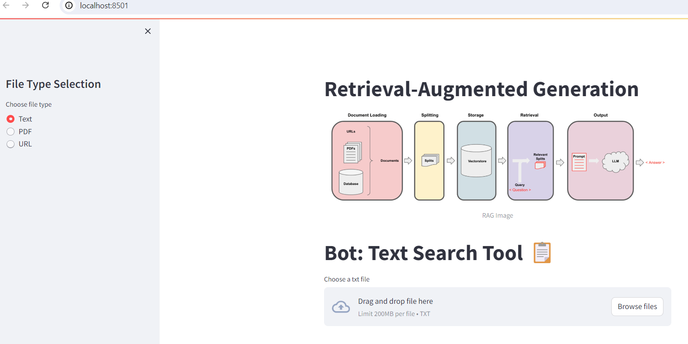

# GenAI-RAG

# Bot: Research Tool 

Bot is an intuitive research tool designed for easy information retrieval. 
It allows users to input article URLs and search through text, PDFs, and web content



## Steps

1.Clone this repository to your local machine using:

```bash
  git clone https://github.com/alexvatti/GenAI-RAG.git
```
2.Navigate to the project directory:

```bash
  cd GenAI-RAG
```
3. Install the required dependencies using pip:

```bash
  pip install -r requirements.txt
```
## Usage/Examples

1. Run the Streamlit app by executing:
```bash
streamlit run main.py